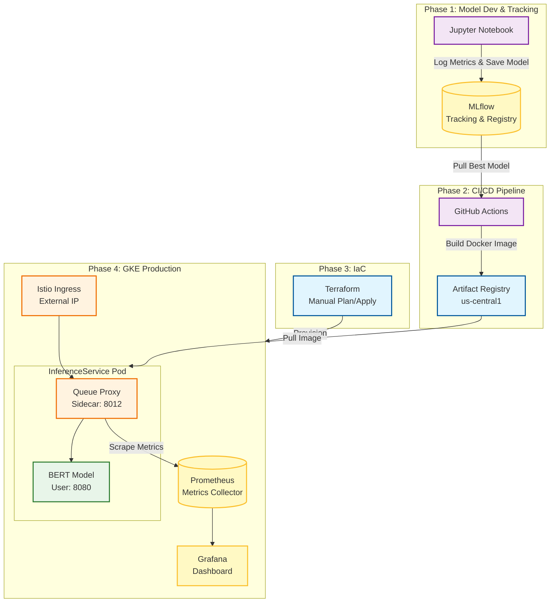
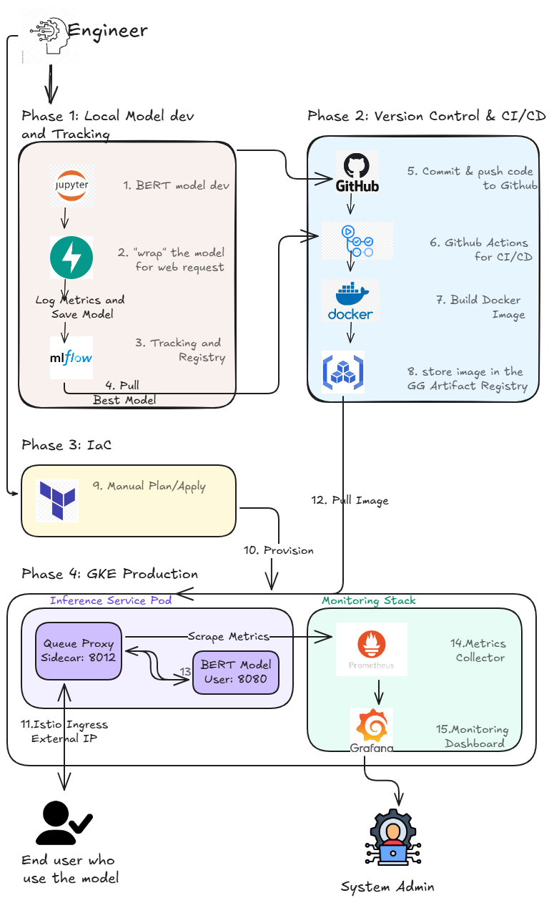

# Sentiment Analysis Serving on GKE

**(A scalable MLOps system for real-time sentiment inference using KServe and Google Kubernetes Engine)**

---

## Table of Contents

- [System Architecture](#system-architecture)
- [Tech Stack](#tech-stack)
- [Introduction](#introduction)
- [Production Deployment Status](#production-deployment-status)
- [Problem Definition](#problem-definition)
- [Model Design](#model-design)
- [Repository Structure](#repository-structure)
- [Prerequisites](#prerequisites)
- [Installation & Setup](#installation--setup)
  - [1. Infrastructure Provisioning (Terraform)](#1-infrastructure-provisioning-terraform)
  - [2. Model Deployment (KServe)](#2-model-deployment-kserve)
- [API Usage](#api-usage)
- [Monitoring & Observability](#monitoring--observability)
- [Configuration](#configuration)

---

## System Architecture
The system follow a cloud-native pattern, utilizing Istio for traffic management and Kserve for serverless model inferencing.

### Project pipeline



### System Architect

------


## Production Deployment Status
The system has been successfully deployed to Google Cloud production infrastructure.

### Cluster Information
| Property | Value |
|----------| ----- |
| Cluster | sentiment-analysis-cluster |
| Region | us-central1 |
| Node Count | 3 (Autoscaling) |
| Node Type | e2-standard-4 |
| Status | Successfully Deployed |

## Tech Stack
| Layer | Technology | Purpose |
|-------| ---------- | ------- |
| ML Framework | PyTorch, Transformers | Model logic and inference |
| Base Model | BERT-base-multilingual | Text classification backbone |
| Containerization | Docker | Packaging the model environment |
| Container Registry | Google Artifact Registry | Private image storage |
| Kubernetes | GKE (Google Kubernetes Engine) | Production orchestration |
| Model Serving | KServe, Knative | Scalable, serverless model inference |
| Service Mesh | Istio | Ingress gateway and request routing |
| Iac | Terraform | Infrastructure as Code provisioning |

### Implementation

#### Group1: Model and data management
- DVC: manages large files
- MLFlow: uses Python scripts for logging Hugging Face Model to MLFlow

#### Group2: Infrastructure
- Iac (Terraform): creates K8s clutter on GKE
- Helm: instead writting lots of yml files seperately, Helm packes them into Helm "chart"
- Istio Gateway: serves as a protecting layer, request for user/pw where API called

#### Group3: Serving and API (FastAPI, KServe)
- FastAPI
- KServe: scale model to 0 when there are no usage for cost saving.
- Knative Serving: provides a serverless framework on Kubernetes for deploying and managing AI/ML model inference services, enables automatic scaling—including down to zero to save costs, manages model prevision and control requests to BERT.

#### Group4: Monitoring and qualification (CICD, Monitoring, Logging)
- CICD: GỉtHub Actions - test pytest, if test can cover > 80% => automatically build
        Build/Deploy: packs Docker Image, approve to deploy
- Monitoring: Prometheus/Grafana - track CPU/RAM
- Logging/Tracing: Prometheus/Grafana - track error logs and request from input to output.

## Introduction 
This project implements a complete MLOps Pipeline to serve a Vietnamese Sentiment Analysis model. This goal was to move beyond local development to create a production-ready environment on Google Cloud that can handle real-time, scale automatically, and provide a clean API interface for end-users.

## Problem Definition
Sentiment Analysis for Vietnamese statement:
- Input: String (optimzed for under 512 tokens for BERT)
- Output: Label and Confidence Score.

### Input Format
The API accepts a raw string of text and return a sentiment classification.

| Field | Type | Description |
| ----- | ---- | ----------- |
| text | String | The Vietnamese text to be analyzed |

### Output 
The model classifies input into three primary sentiment categories:
- Positive: Expresses satisfaction or approval.
- Neutral: Objective or non-opinionated text.
- Negative: Expresses dissatisfaction or criticism.

### Data Schemas

```python
from pydantic import BaseModel
import uvicorn
import os

# Định dạng dữ liệu đầu vào
class SentimentRequest(BaseModel):
    text: str

# Định dạng dữ liệu đầu ra
class SentimentResponse(BaseModel):
    text: str
    label: str
    score: float
```
### Core Inference Logic
```python
from fastapi import FastAPI, HTTPException

app = FastAPI(title="Sentiment Analysis API", version="1.0.0")
@app.post("/predict", response_model=SentimentResponse)
async def predict(request: SentimentRequest):
    """
    Logic chính: Tiếp nhận text và gửi đến model hoặc xử lý trực tiếp.
    có thể thêm logic gọi tới KServe InferenceService tại đây.
    """
    if not request.text.strip():
        raise HTTPException(status_code=400, detail="Text cannot be empty")
    
    # Giả lập logic dự báo (Mai sẽ thay bằng logic gọi Model thật sau)
    # Ví dụ: Một logic đơn giản để pass Pytest trước
    dummy_label = "POSITIVE" if "love" in request.text.lower() else "NEGATIVE"
    
    return {
        "text": request.text,
        "label": dummy_label,
        "score": 0.95
    }

```

## Model Design
### Overview
The deployment uses a Pridictor architecture. The model is wrapped in a FastAPI/Ubicorn server (Custom Predictor) or served via Kserve'd builf-in runtimes.

### Serving Flow
#### 1. Request Ingestion: Request hits the Istio Ingress Gateway.
#### 2. Sidecar Processing: The Knative queue-proxy (Port 8012) intercepts the request for metrics and scaling logic.
#### 3. Model Inference: The request is passed to the Model Container (Port 8080).
#### 4. Response: The prediction is sent bacck as a structured JSON object.

## Repository Structure

```
.
├── Dockerfile
├── mlflow.db
├── readme.md
├── requirements.txt
├── .dvc/
├── .github/
├── .pytest_cache/
├── data/
├── deployment/
│   ├── .terraform/
│   └── helm/
│       └── aide-api/
├── images/
├── mlruns/
├── models/
├── src/
│   ├── main.py
│   ├── preprocess.py
│   ├── train_logger.py
│   ├── __init__.py
│   └── __pycache__/
└── tests/
```

## Prerequisites
| Tool | Version | Purpose |
| ---- | ------- | ------- |
| Google Cloud SDK | latest | Cloud resource management |
| Terraform | >= 1.5 | Infrastructure provisioning |
| kubectl | >= 1.28 | Kubernetes cluster management |
| Docker | latest | Container building |

## Installation & Setup
### 1. Infrastructure Provisioning (Terraform)
Initialize and create the GKE cluster:
 ``` Bash
 cd deployment
 terraform init
 terraform plan -out=main.plan
 terraform apply "main.plan"
 ```

 ### 2. Model Deployment (KServe)
 Deploying via KServe automatically handles the creation of a new Knative Revision, ensuring zero-downtime rollouts and traffic splitting capabilities.
 ``` Bash
 kubectl apply -f kserve/service.yaml
 ```
 Verify the deployment status, ensure READY = True:
 ``` Bash
 kubectl get inferenceservice sentiment-model
 ```

 ### API Usage
 Using Istio Gateway for receive traffic
 #### Step 1: Get Istio External IP
 ```Bash
 kubectl get svc istio-ingressgateway -n istio-system
 ```
 Note: Notedown/copy EXTERNAL-IP returned

 #### Step 2: Get Service Hostname
 ```Bash
kubectl get inferenceservice sentiment-model -o jsonpath='{.status.url}'
 ```

 #### Step 3: Send Request
 Using cURL, IP and Hostname for calling API via internet:
 ```Bash
 curl -v -H "Host: <HOSTNAME_TỪ_BƯỚC_2>" \
    -H "Content-Type: application/json" \
    -d '{"text": "Dịch vụ của bạn rất tuyệt vời!"}' \
    http://<EXTERNAL_IP_TỪ_BƯỚC_1>/predict
 ```
Example JSON Response:
```JSON
{
    "text": "Dịch vụ của bạn rất tuyệt vời!",
    "label": "POSITIVE",
    "score": 0.992
}
```
## Monitoring & Observability
The project utilizes the following for system health:
- Knative Dashboard: Monitoring request volumn and pod scaling.
- Istio Metrics: Tracking gateway latency and traffic success rates.
- Kubernetes Log: Centralized logging via kubectl logs for debugging.

### Access to Dashboard
```Bash
kubectl port-forward svc/grafana -n monitoring 3000:3000
```
Access the http://localhost:3000 and tracking for monitoring metrics. To easily evaluate system health, administrators should monitor these 3 Golden Signals:

1. Request Volume (RPS): Checks current traffic load.
2. Latency (P95/P99): Ensures the model is returning predictions quickly.
3. Success Rate (HTTP 2xx vs 5xx): Detects if the FastAPI application is crashing.

## Configuration
| Environment Variable | Description | Default |
| -------------------- | ----------- | ------- |
| PORT | Container listening port | 8080 |
| MODEL_NAME | Name of the served model |
| MODEL_VERSION | Version of the model image | v1.0.0 |


