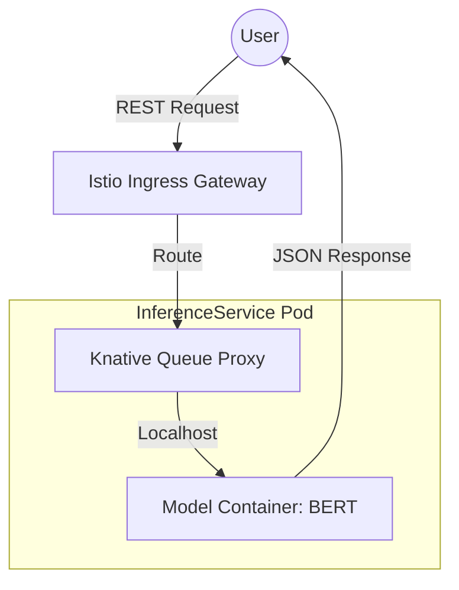

# Sentiment Analysis Serving on GKE

**(A scalable MLOps system for real-time sentiment inference using KServe and Google Kubernetes Engine)**

---

## Table of Contents

- [System Architecture](#system-architecture)
- [Tech Stack](#tech-stack)
- [Introduction](#introduction)
- [Production Deployment Status](#production-deployment-status)
- [Problem Definition](#problem-definition)
- [Model Design](#model-design)
- [Repository Structure](#repository-structure)
- [Prerequisites](#prerequisites)
- [Installation & Setup](#installation--setup)
  - [1. Infrastructure Provisioning (Terraform)](#1-infrastructure-provisioning-terraform)
  - [2. Model Deployment (KServe)](#2-model-deployment-kserve)
- [API Usage](#api-usage)
- [Monitoring & Observability](#monitoring--observability)
- [Configuration](#configuration)

---

## System Architecture
The system follow a cloud-native pattern, utilizing Istio for traffic management and Kserve for serverless model inferencing.




## Production Deployment Status
The system has been successfully deployed to Google Cloud production infrastructure.

### Cluster Information
| Property | Value |
|----------| ----- |
| Cluster | sentiment-analysis-cluster |
| Region | asia-southeast1 |
| Node Count | 3 (Autoscaling) |
| Node Type | e2-standard-4 |
| Status | Successfully Deployed |

## Tech Stack
| Layer | Technology | Purpose |
|-------| ---------- | ------- |
| ML Framework | PyTorch, Transformers | Model logic and inference |
| Base Model | BERT-base-multilingual | Text classification backbone |
| Containerization | Docker | Packaging the model environment |
| Container Registry | Google Artifact Registry | Private image storage |
| Kubernetes | GKE (Google Kubernetes Engine) | Production orchestration |
| Model Serving | KServe, Knative | Scalable, serverless modek inference |
| Service Mesh | Istio | Ingress gateway and request routing |
| Iac | Terraform | Infrastructure as Code provisioning |

## Introduction 
This project implements a complete MLOps Pipeline to serve a Vietnamese Sentiment Analysis model. This goal was to move beyond local development to create a production-ready environment on Google Cloud that can handle real-time, scale automatically, and provide a clean API interface for end-users.

## roblem Definition
### Input Format
The API accepts a raw string of text and return a sentiment classification.

| Field | Type | Description |
| ----- | ---- | ----------- |
| text | String | The Vietnamese text to be analyzed |

### Taxonomy 
The model classifies input into three primary sentiment categories:
- Positive: Expresses satisfaction or approval.
- Neutral: Objective or non-opinionated text.
- Negative: Expresses dissatisfaction or criticism.

## Model Design
### Overview
The deployment uses a Pridictor architecture. The model is wrapped in a FastAPI/Ubicorn server (Custom Predictor) or served via Kserve'd builf-in runtimes.

### Serving Flow
#### 1. Request Ingestion: Request hits the Istio Ingewss Gateway.
#### 2. Sidecar Peocessing: The Knative queue-proxy (Port 8012) intercepts the request for metrics and scaling logic.
#### 3. Model Inference: The request is passed to the Model Container (Port 8080).
#### 4. Response: The prediction is sent bacck as a structured JSON object.

## Repository Structure

```

 .
├── Dockerfile
├── mlflow.db
├── readme.md
├── requirements.txt
├── .dvc/
├── .github/
├── .pytest_cache/
├── data/
├── deployment/
│   ├── .terraform/
│   └── helm/
│       └── aide-api/
├── images/
├── mlruns/
├── models/
├── src/
│   ├── main.py
│   ├── preprocess.py
│   ├── train_logger.py
│   ├── __init__.py
│   └── __pycache__/
└── tests/
```

## Prerequisites
| Tool | Version | Purpose |
| ---- | ------- | ------- |
| Google Cloud SDK | latest | Cloud resource management |
| Terraform | >= 1.5 | Infrastructure provisioning |
| kubectl | >= 1.28 | Kubernetes cluster management |
| Docker | latest | Container building |

## Installation & Setup
### 1. Infrastructure Provisioning (Terraform)
Initialize and create the GKE cluster:
 ``` Bash
 cd deployment
 terraform init
 terraform apply -auto-approve
 ```

 ### 2. Model Deployment (KServe)
 Apply the KServe manifest to the cluster"
 ``` Bash
 kubectl apply -f kserve/service.yaml
 ```
 Verify the deployment status:
 ``` Bash
 kubectl get inferenceservice sentiment-model
 ```

 ### API Usage
 Local Testing via Port-forwading:
 ``` Bash
 kubectl port-forward [POD_NAME] 8888:8012
```

Predict Sentiment via cURL:
``` Bash
curl -X POST -H "Content-Type: application/json" \
    -d '{"text": "tuyệt vời" }' \
    httpL//localhost:8888/predict
```

Example JSON Responce:
``` JSON 
{
    "text": "tuyệt vời",
    "label": "POSITIVE",
    "score": 0.992
}
```
## Monitoring & Observability
The project utilizes the following for system health:
- Knative Dashboard: Monitoring request volumn and pod scaling.
- Istio Metrics: Tracking gateway latency and traffic success rates.
- Kubernetes Log: Centralized logging via kubectl logs for debugging.

## Configuration
| Environment Variable | Description | Default |
| -------------------- | ----------- | ------- |
| PORT | Container listening port | 8080 |
| MODEL_NAME | Name of the served model |
| MODEL_VERSION | Version of the model image | v1.0.0 |


